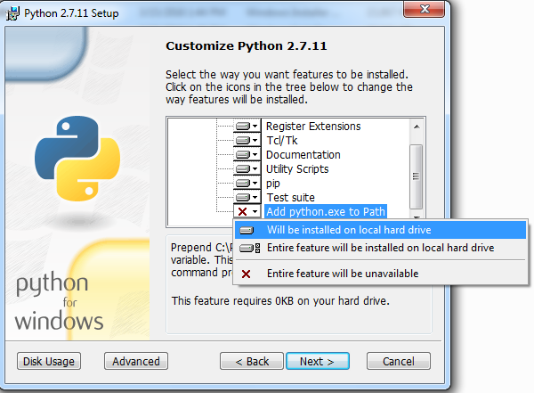

Installing Python and Pip
=========================

*Written by PChan on 2017-04-07*

* :ref:`installation_programming_languages_python_pip_linux`
* :ref:`installation_programming_languages_python_pip_mac_osx`
* :ref:`installation_programming_languages_python_pip_windows`

.. _installation_programming_languages_python_pip_linux:

Linux
-----
Most Linux distro generally come with Python already installed.  The only distros that are known to come
with Python3 instead of Python2 are Arch Linux and Gentoo.  Users of those distros should do what they
need to install Python2 (or use `pyenv <https://github.com/yyuu/pyenv>`_).

To install Pip (Python package manager):

* Ubuntu/Mint/Debian
  ::

     $ sudo apt-get install python-pip

* Fedora 21 (and lower)
  ::

     $ sudo yum upgrade python-setuptools
     $ sudo yum install python-pip python-wheels

* Fedora 22 (and higher)
  ::

     $ sudo dnf upgrade python-setuptools
     $ sudo dnf install python-pip python-wheels

* On other distros, you probably already know how...`

.. _installation_programming_languages_python_pip_mac_osx:

Mac OSX
-------
Like most Linux Distros, Python 2.7.x is already installed so there's no need to worry about it.  To
install pip (package manager for Python) when using the preinstalled version of Python, run the following
command:
::

   $ sudo easy_install pip

Alternative
^^^^^^^^^^^
If you do want to install a more updated version (not necessary for Intro), follow the instructions below
to install via Homebrew:

1. Install Homebrew following the :ref:`installation_system_tools_homebrew` guide if it is not already
   installed
2. Install Python and pip (Python package manager) by executing the following command in the terminal:
   ::

      $ brew install python

Note: In the future, update Python with the following command:
::

   $ brew update python

.. _installation_programming_languages_python_pip_windows:

Windows
-------
.. important::
   Make sure to install **version 2.7.x** instead of **version 3.6.x**!

Generally, you will install Python 2.7 from `here <https://www.python.org/downloads/release>`_.  Simply
click on the **Download Python 2.7.x** (where x is an int) button.  Scroll down to the very bottom and
download the appropriate version for your computer.  To find out whether you are using x32 or x64 bit OS,
check out `this guide from Microsoft <https://support.microsoft.com/en-us/help/13443/windows-which-operating-system>`_.

When you run the executable, pay attention on the Customize Python screen (screenshot below).  Make sure
that the following features are selected (check the tip below if you are not sure):

1. The *pip* option
2. The *Add Python.exe to Path* option

.. tip::
   In the screenshot below, notice the red **x** next to the *Add Python.exe to Path* feature.  Click on
   that red **x** and choose the *Will be installed on local hard drive* option to select it.

The default options for the rest of the process is fine.  Lastly, make sure to add Pip to your path.  That
is read the instructions in :ref:`tutorials_system_windows_path_modifying_windows_path` guide and add
``C:\Python27\Scripts`` to your path.  Congratulation!

Alternative
^^^^^^^^^^^
An alternative to vanilla Python is `Anaconda <https://www.continuum.io/downloads#windows>`_. which has a
few notable advantages:

* Automatically add itself to the path
* Comes with multiple libraries already installed including pip (Recommended when working on side projects)

.. important::
   Remember to download the **Python 2.7** version!

After you download the executable, run it and follow the instructions to install Python.
