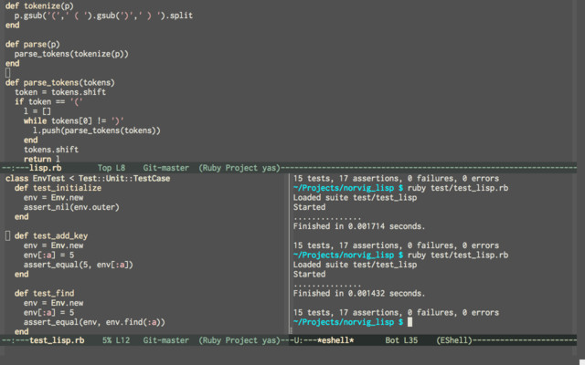

.. |br| raw:: html

    

.. _tutorials_programming_tools_emacs_introduction_to_emacs:

Introduction to Emacs
=====================

*Written by PChan on 2016-12-08*

* :ref:`tutorials_programming_tools_emacs_what_is_emacs`
* :ref:`tutorials_programming_tools_emacs_using_emacs`

  * :ref:`tutorials_programming_tools_emacs_emacs_keybinding`
  * :ref:`tutorials_programming_tools_emacs_text_navigation`
  * :ref:`tutorials_programming_tools_emacs_text_editing`
  * :ref:`tutorials_programming_tools_emacs_search_and_replace`
* :ref:`tutorials_programming_tools_emacs_frames_and_windows`
* :ref:`tutorials_programming_tools_emacs_buffers`
* :ref:`tutorials_programming_tools_emacs_now_what`

.. highlight:: none
  
.. _tutorials_programming_tools_emacs_what_is_emacs:

What is Emacs
-------------
Emacs is a multi-purpose extensible text editor built upon Elisp (think Scheme).  If you are interested in
trying out Emacs, check out the :ref:`installation_programming_tools_emacs` guide.

.. _tutorials_programming_tools_emacs_using_emacs:

Using Emacs
-----------
Let us go over the key notations in Emacs
::

   C-    (press and hold) the Control/Ctrl key
   M-    (press and hold) the Meta/Alt key
   S-    (press and hold) the Shift key
   DEL   backspace key, sometimes written as <backspace>
   RET   Return or Enter key
   SPC   Space bar/Space key
   ESC   Escape key
   TAB   Tab key

``C-x C-f`` means while holding down the ``Ctrl`` key, press the ``x`` key and then press the ``f`` key
|br|
``M-x`` means while holding down the ``Alt`` key or the ``Meta`` key, press the ``x`` key

Some common Emacs commands:
::

   Key        Commands                      What it does
   C-x C-c    save-buffers-kill-terminal    Exit Emacs
   C-x C-s    save-buffer                   Save file
   C-x C-f    find-file                     Open file or create it if it does not exists
   C-h C-h    help-for-help                 Open up the help window
   C-g        keyboard-quit                 Quit a partially entered command

.. note::
   To execute commands in the second column, you would do ``M-x <command>``

.. _tutorials_programming_tools_emacs_emacs_keybinding:

Emacs Keybinding
^^^^^^^^^^^^^^^^
There are quite a few and easy rules to remember regarding Emacs binding

* ``C-x`` is the default global prefix
* ``C-c`` prefix is typically used for user-defined commands
* ``C-<number>`` passes a number to a command, usually used to specify how many times to repeat a command

Think of *prefix* as a key sequence that tells Emacs to interpret the next set of keystrokes differently.
For example, the global Emacs *prefix*, ``C-x``, comes before the default Emacs commands.  To open a file,
you would do ``C-x`` and then ``C-f`` (f is for file).

.. _tutorials_programming_tools_emacs_text_navigation:

Emacs Text Navigation
^^^^^^^^^^^^^^^^^^^^^
In Emacs, *point* refers to the location of the cursor.  In most cases, *point* and cursor can be used
interchangeably.

Productivity is increased when you use the keyboard instead of the mouse.  Here are the basic navigation
keybindings in Emacs that are also used by popular shells such as bash or zsh:
::

   Key        Commands                      What it does
   C-f        forward-char                  Move point forward one character
   C-b        backward-char                 Move point backward one character
   C-p        previous-line                 Move point up one line
   C-n        next-line                     Move point down one line
   C-a        beginning-of-line             Move point to the beginning of the current line
   C-e        end-of-line                   Move point to the end of the current line
   M-f        forward-word                  Move point forward one word
   M-b        backward-word                 Move point backward one word

Some additional navigation commands that are only available in Emacs:
::

   Key        Commands                      What it does
   M-a        backward-sentence             Move point to the beginning of current sentence
   M-e        forward-sentence              Move point to the end of the current sentence
   M-<        beginning-of-buffer           Move point to the beginning of the current buffer
   M->        end-of-buffer                 Move point to the end of the current buffer

**Exercise:** Practice the commands above a couple of times to get a feel for them.

.. _tutorials_programming_tools_emacs_text_editing:

Text Editing
^^^^^^^^^^^^
It is nice to know how to move around, but what about copying, cutting, pasting, or undoing?  In Emacs,
cutting is known as *killing* and pasting is known as *yanking*.

Here are some basic Emacs editing key bindings (some also work in the terminal):
::

   Key        Commands                      What it does
   DEL        delete-backward-char          Delete the highlighted region or character before the point
   C-d        delete-char                   Delete the character at point (Same as the delete key)
   M-\        delete-horizontal-space       Delete all spaces and tabs around point
   M-SPC      just-one-space                Delete all spaces and tabs around point except for one space
   M-d        kill-word                     Kill to the end of a word starting at point
   M-DEL      backward-kill-word            Kill to the beginning of a word starting at point
   C-S-DEL    kill-whole-line               Kill the entire line (only non-terminal Emacs)
   C-k        kill-line                     Kill to the end of the line
   M-k        kill-sentence                 Kill to the end of sentence
   C-x DEL    backward-kill-sentence        Kill to the beginning of sentence
   C-w        kill-region                   Kill the highlighted region

.. important::
   *Delete* and *kill* means two different things.  When you *delete* something, it is gone **forever!!**
   When you *kill* something, it is saved to the *kill ring* which can be thought of as the clipboard.

Great, but how would you paste something?
::

   Key        Commands                      What it does
   C-y        yank                          Yank the most recent kill into the buffer
   M-y        yank-pop                      Replace the yanked text with an earlier kill

``C-y`` is your normal paste operation.  However, Emacs keeps a history of all your previous *kills* and
you can retrieve those via ``M-y``.  If you were to cut or copy something from another application more
recently than your last kill, ``C-y`` would *yank* from the clipboard.
   
.. warning::
   ``M-y`` can only be used after a previous ``M-y`` or a ``C-y``.  After doing ``M-y``, successive
   ``C-y`` will *yank* the same thing instead of your most recent *kill*.  After reaching the beginning
   of the *kill ring*, executing ``M-y`` would wrap back to the most recent *kill*.

Emacs uses the following command to copy:
::

   Key        Commands                      What it does
   M-w        kill-ring-save                Copy the highlighted region

We keep saying *highlighted region*, but how would you highlight a region without using the mouse?  The
answer is:
::

   Key        Commands                      What it does
   C-SPC      set-mark-command              Toggle the activation of the mark

When you press ``C-SPC`` the first time, Emacs set the mark at *point*.  When you move the *point* around,
the region between the *point* and the location of the mark is highlighted.  To get rid of the mark, press
it twice: ``C-SPC C-SPC``.

**Exercise:** Now create a text file in Emacs and type something in it.  Practice highlighting different
regions and using Emacs shortcuts to delete, *kill*, and *yank* text around.

Now you may be wondering, how would undo your most recent change.  The following command would solve your
issue:
::

   Key        Commands                      What it does
   C-/        undo                          Undo your most recent change (or redo them)
   C-x u      undo                          Undo your most recent change (or redo them)

When you press ``C-/`` or ``C-x u``, you undo your most recent change.  Any command other than the
``undo`` command would break the undo sequence and push the entire sequence of undo commands as a single
set of changes.  For example, to reverse an undo, you might press ``C-f`` and then press ``C-/`` or
``C-x u``.

.. _tutorials_programming_tools_emacs_search_and_replace:

Searching and Replacing
^^^^^^^^^^^^^^^^^^^^^^^
One of the most important operation when editing text is find and replace.  In Emacs, searching is done
via:
::

   Key        Commands                      What it does
   C-s        isearch-forward               Perform an incremental search from point onward
   C-r        isearch-backward              Perform an incremental search backward from point

When you press ``C-s``, you would notice that Emacs start searching the moment you enter a single
character.  It also highlights all instances of the query.  Pressing ``C-s`` again would move the point to
the next instance of the query.  Pressing ``C-r`` would move the point to the previous instance of the
query.  Cancel the search by pressing ``C-g``.

**Exercise:** Open up a large text file or create a new file and dump a large amount of text in it.
Practice using ``C-s`` and ``C-r`` to search through the file.

Replacing in Emacs is done via:
::

   Key                    Commands                      What it does
   M-%  (Meta-Shift-5)    query-replace                 Replace a string with a different string

Each instance of the query would prompt you for one of the following characters:
::

   SPC                   replace the current occurence with the new string
   y

   DEL                   skip the current occurence
   delete
   n

   C-g                   exit without doing any more replacement
   RET
   q

   .                     replace the current occurence and then exit
   !                     replace all remaining occurences without prompting
   ^                     go back to the previous occurence

If you press ``M-%`` after doing ``C-s`` or ``C-r``, it would look for the current search string and
prompt you for the replacement (Find and replace).

**Exercise:** Open up a large text file and practice these new commands.

.. _tutorials_programming_tools_emacs_frames_and_windows:

Frames and Windows
------------------
.. image:: ../../images/software_tutorials/programming_tools/emacs/emacs-terminology.png

In Emacs, GUI windows are refer to as *frames*.  Each Emacs *window* contains a *buffer*.  When editing
files, it may be helpful to look at multiple files at the same time.  To do this, we use the following
commands:
::

   Key      Commands              What it does
   C-x 2    split-window-below    Split the current window in half vertically
   C-x 3    split-window-right    Split the current window in half horizontally

After splitting the *window*, you will notice that both *windows* contain the same content.  This is
hardly useful.  To change that, we will need to know the following command:
::

   Key      Commands              What it does
   C-x o    other-window          Move the cursor to the other window

   
To get the same layout as the picture above, execute the following commands in a new instance of Emacs:
::

   Key      Commands
   C-x 2    split-window-below
   C-x o    other-window
   C-x 3    split-window-right

**Exercise:** Use what you learn just now to move the point/cursor to the top *window*.

.. _tutorials_programming_tools_emacs_buffers:

Buffers
-------
When you open a file in Emacs, the file is contained in a separate *buffer*, which is a temporary copy of
your file that you may modify as you please.  To keep the changes, you would call the ``save-buffer``
command, which is bound to ``C-x C-s``.  If you wish to save it under a different name (think "Save as"
in other editors), you would call the ``write-buffer`` command, which is bound to ``C-x C-w``.

To *kill* a *buffer*, use ``C-x k`` or call the ``kill-buffer`` command.  Then, press ``RET`` to *kill*
the current *buffer*.  You may also type the name of the *buffer* you wish to *kill* followed by ``RET``.
*Buffer* names are typically the same as the file name.

.. important::
   *Files* and *buffers* are two distinct concepts.  *Buffers* refer to the temporary content of a file,
   while *files* refer to the physical file on your disk.  *Killing* a *buffer* does not delete the actual
   physical file.

To switch to a different *buffer*, use the ``switch-to-buffer`` command which is bound to ``C-x b``.

**Here is an exercise for you:**

* Open/Create the file hi.txt
* Modify hi.txt
* Open/Create the file bye.txt
* Switch back to the buffer named hi.txt

Notice that any modifications you made to the original *buffer* (ie hi.txt) is still there.  This is
because the content of a buffer is stored in memory after the initial read which is faster than reading
the file from disk every single time.

.. _tutorials_programming_tools_emacs_now_what:

Now What...
-----------
Use what you learn about *buffers* and *windows* to boost your productivity.  Learn the shortcuts to
maximize your productivity! :)

Here are some additional resources to expand your Emacs knowledge:

  * Start with the `Emacs Wiki <https://emacswiki.org/>`_.  You might need to scroll down a bit for the
    meaningful information.
  * To keep track of the various Emacs commands, check out the `Emacs Survival Reference Card <http://www.sluug.org/resources/presentations/2016/2016-01-13/Emacs_24_refcard-P1.pdf>`_.
    
.. highlight:: python
