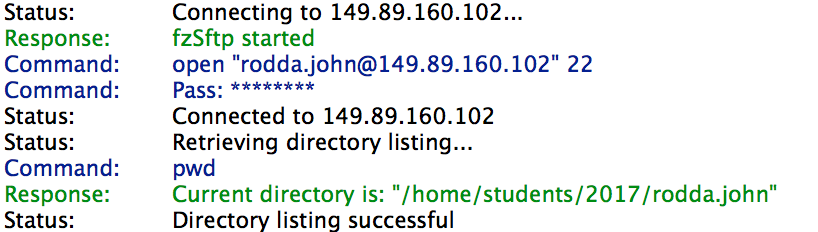
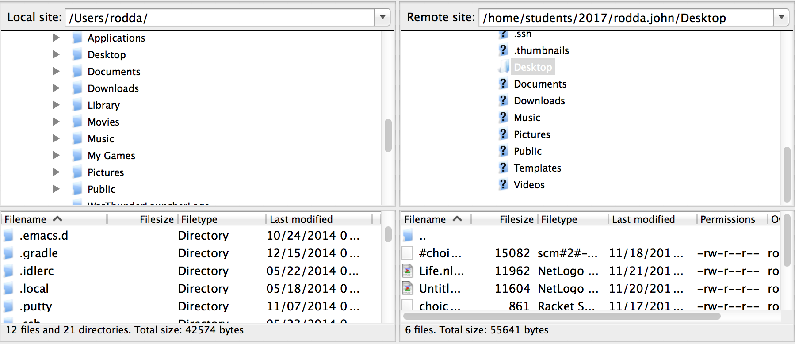
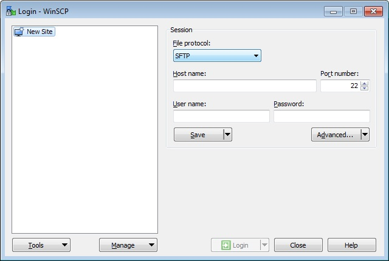
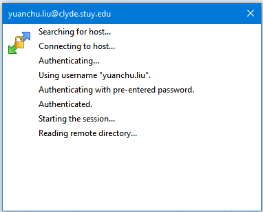
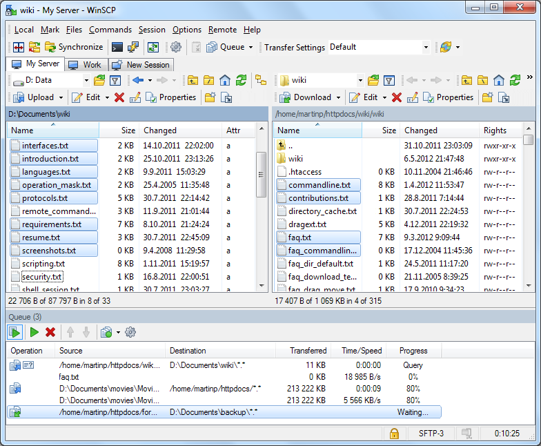

Introduction to Remote File Transfer
====================================

*Written by PChan on 2017-03-18*

* :ref:`tutorials_remote_file_transfer_using_filezilla`

  * :ref:`tutorials_remote_file_transfer_filezilla_authentication`
  * :ref:`tutorials_remote_file_transfer_filezilla_session`
* :ref:`tutorials_remote_file_transfer_using_winscp`

  * :ref:`tutorials_remote_file_transfer_winscp_authentication`
  * :ref:`tutorials_remote_file_transfer_winscp_session`
* :ref:`tutorials_remote_file_transfer_using_terminal_or_git_bash`

  * :ref:`tutorials_remote_file_transfer_scp`
  * :ref:`tutorials_remote_file_transfer_rsync`

.. _tutorials_remote_file_transfer_using_filezilla:

Using FileZilla
---------------
FileZilla is a graphical program that is used primarily for transferring files between a local machine and
a remote machine.  If you have not done so already, install the program following the
:ref:`installation_file_transfer_utilities_ssh_programs_installing_filezilla` guide.

.. _tutorials_remote_file_transfer_filezilla_authentication:

Authenticating Yourself
^^^^^^^^^^^^^^^^^^^^^^^
After executing the program, the first step to connecting is to enter your credentials.  Near the top of
the program, you should see a bar like the following (yours would not have text):

Fill in the following information:

  * **Host**: clyde.stuycs.org
  * **Username**: the username for your StuyCS account
  * **Password**: the password for your StuyCS account
  * **Port**: 22

Lastly, click on the **Quick Connect** button. Below that, you should see the progress similar to the
image below.

.. _tutorials_remote_file_transfer_filezilla_session:

Transferring Files with FileZilla
^^^^^^^^^^^^^^^^^^^^^^^^^^^^^^^^^
After you have successfully connected, the multi-pane panel near the bottom of the screen should be
populated similar to the following image:

To copy from the local machine to the remote machine, locate the file on the left pane and then simply
drag the file from the left pane to the right pane.  To copy from the remote machine to the local machine,
locate the file on the right pane and then simply drag the file from the right pane to the left pane.

.. note::
   In the file listing, ``..`` refers to the parent directory.  Click on it to go up one directory.

.. _tutorials_remote_file_transfer_using_winscp:

Using WinSCP
------------
WinSCP is a third-party Windows-only program that is used primarily for transferring files between a local
machine and a remote machine.  If you have not done so already, install the program by following the
:ref:`installation_file_transfer_utilities_ssh_programs_installing_winscp` guide.

When you execute the program, you should see a pop up similar to the one below:

.. _tutorials_remote_file_transfer_winscp_authentication:

Authenticating Yourself
^^^^^^^^^^^^^^^^^^^^^^^
To log in, you need to fill in the following fields:

  * **Host name**: clyde.stuycs.org
  * **User name**: the username for your StuyCS account
  * **Password**: the password for your StuyCS account

Lastly, click on the Login button near the bottom of the window.  As the program attempts to connect to
the remote machine, you would see the following window detailing the progress...

.. _tutorials_remote_file_transfer_winscp_session:

Transferring Files with WinSCP
^^^^^^^^^^^^^^^^^^^^^^^^^^^^^^
After you successfully authenticated yourself, you should see something like the window below (with
different filenames):

The left panel is the file listing of your local machine and the right panel is the file listing of the
remote machine.

To move files from your local machine to the remote machine, simply look for the file in the left panel
and drag it over to the right panel.  To get a file from the remote machine, simply drag the file from the
right panel to the left panel.

.. note::
   In the file listing, ``..`` refers to the parent directory.  Click on it to go up one directory.

.. _tutorials_remote_file_transfer_using_terminal_or_git_bash:

Using Git Bash or Terminal
--------------------------
It is also possible to transfer files over via the terminal or Git Bash for those who no longer need the
graphical interface (recommended for APCS and up).  The two commands that we would look at are: ``scp``
and ``rsync``.

.. _tutorials_remote_file_transfer_scp:

Using SCP
^^^^^^^^^
The ``scp`` command is very similar to its cousin: ``cp``. While it is used to copy files, it is meant to
copy files from or to a remote machine (although it can do local file transfer as well).  ``scp`` stands
for secure copy and utilizes the following syntax:
::

   $ scp username@hostname:source_path username@hostname:destination_path

When it prompts you for a password, simply enter the password for the account that you are accessing
remotely.  If you are transferring files from or to the school machines, this would be the password you
use to log into the CS lab machines.

.. note::
   If you want to copy over a directory, simply add the ``-r`` flag.  Any flags that are valid for the
   ``cp`` command are also valid for the ``scp`` command.

When transferring the .bashrc file from your school account to the current directory, the format would
look like this:
::

   $ scp patrick.chan@clyde.stuycs.org:~/.bashrc .

Usually, you only need to specify the username and hostname for one of the parameter and the other
parameter would simply be the path on your local machine.  However, if you were to transfer between two
remote machines, both parameters would need a username and hostname in the format specified above.

.. tip::
   You might have notice that you need to enter your password to the school account every time you run the
   command.  To simplify the process, take a look at the :ref:`tutorials_remote_file_transfer_ssh_keys_transfer_authentication` guide.

There are situations where you might need to transfer ``*.java`` files (all files ending in .java) over.
To transfer those files from the current directory of your local machine to the school computer:
::

   $ scp *.java username@clyde.stuycs.org:~/<path/to/store/your/java/files>

To transfer the files from the school machine to the current directory of your local machine, you might
do:
::

   $ scp username@clyde.stuycs.org:~/apcs/hw01/\*.java .

.. important::
   Make sure to escape the asterisk/wild card symbol with a backslash (``\``) here or else you will get
   an error.

.. _tutorials_remote_file_transfer_rsync:

With RSync
^^^^^^^^^^
When transferring large files or large amount of data in general, you might want to use the ``rsync``
command.  Similar to ``scp``, it can be used to transfer files from remote machines, but it increases
performance by compressing the data and only transferring the difference between the local version and the
remote version.  Nevertheless, you will typically use ``scp`` for your daily task and ``rsync`` for
recurring tasks such as backups.

The most basic syntax for ``rsync`` is:
::

   $ rsync -avzP username@hostname:source_path username@hostname:destination_path

A brief explanation on the flags:

* ``-a``: archive mode, preserve permission
* ``-v``: verbose mode, print out what it is doing
* ``-z``: compress file data, make it smaller
* ``-P``: preserve partially completed data (run the same command again to continue an interrupted
  transfer)

.. note::
   To transfer a directory, add the ``-r`` flag, similar to the ``cp`` command or the ``scp`` command.

When it prompts you for a password, simply enter the password for the account that you are accessing
remotely. If you are transferring files from or to the school machines, this would be the password you use
to log in to the CS lab machines.

.. important::
   ``rsync`` does not provide security while you transfer data, so it is in your best interest to run it
   under ``ssh``.  Do so by adding this additional flag: ``-e ssh``.

Here is an example:
::

   $ rsync -avzP -e ssh .bashrc patrick.chan@clyde.stuycs.org:~/.bashrc

   
Like the ``scp`` command, you usually need to specify the username and hostname just for the remote
machine unless you are transferring between two remote machines.

.. tip::
   You might have notice that you need to enter your password to the school account every time you run the
   command.  To simplify the process, take a look at the :ref:`tutorials_remote_file_transfer_ssh_keys_transfer_authentication` guide.
