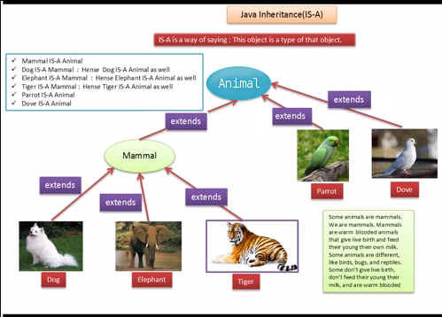

Inheritance
===========

*Written by PChan on 2017-04-23*

* :ref:`tutorial_apcs_ap_java_inheritance_overview`
* :ref:`tutorial_apcs_ap_java_inheritance_is_a_relationship`
* :ref:`tutorial_apcs_ap_java_inheritance_extending_a_class`
* :ref:`tutorial_apcs_ap_java_inheritance_rules_regarding_subclasses`
* :ref:`tutorial_apcs_ap_java_inheritance_overriding_methods`
* :ref:`tutorial_apcs_ap_java_inheritance_object_type_vs_variable_type`
* :ref:`tutorial_apcs_ap_java_inheritance_the_usage_of_super`

.. highlight:: java
  
.. _tutorial_apcs_ap_java_inheritance_overview:

Overview
--------
**Inheritance** is the concept of defining a class, which would retain the characteristics of another
class while augmenting it with unique features.  We can also say that the *subclass* **inherits** the
characteristics of the *superclass* because it share those characteristics without redefining them.

Proper usage of inheritance gives us multiple benefits:

* Reduce duplicate code by moving it to the superclass
* Add new classes quickly and easily by implementing only the new features
* Enforces some degree of uniformity

.. _tutorial_apcs_ap_java_inheritance_is_a_relationship:

"Is-A" Relationship
-------------------

Inheritance is based off the *is-a* relationship.  When we say that A *is-a* B, we are saying that A
inherits the characteristics of B.
	   
.. _tutorial_apcs_ap_java_inheritance_extending_a_class:
  
(Extend)ing a Class
-------------------
To define a subclass, we use the ``extends`` keyword.  The general syntax is shown below:
::

   public class Subclass extends Superclass{
       // additional unique features here
   }

.. warning::
   Each subclass might only *extend* one superclass.
   
.. _tutorial_apcs_ap_java_inheritance_rules_regarding_subclasses:
   
Rules Regarding Subclasses
--------------------------
* Subclasses may add new variables and methods
* Subclasses may override methods from the superclass
* Subclasses may *not* access private instance variables or methods from the superclass
* Subclasses only inherits the default constructor

.. _tutorial_apcs_ap_java_inheritance_overriding_methods:

Overriding Methods
------------------
When you define a method in the subclass and it already exists in the superclass, you are *overriding* the
method provided by the superclass.  This is usually done to provide a different behavior in the subclass
than the one implemented for the superclass.

Here is an example:
::

   public class Panda{

       public void speak(){
           System.out.println("I am a panda!");
       }
       
   }

   public class BluePanda extends Panda{

       public void speak(){
           System.out.println("I am a blue panda!");
       }
       
   }

In the example above, the ``BluePanda`` class *overrides* the ``speak()`` method of the ``Panda`` class.
If we were to evaluate the following snippet:
::

   Panda tom = new Panda();
   BluePanda jerry = new BluePanda();

   tom.speak();
   jerry.speak();

We would get the following output:
::

   I am a panda!
   I am a blue panda!

.. note::
   Notice how the appropriate ``speak()`` method is called in each instance.  This behavior is known as
   :ref:`tutorial_apcs_ap_java_polymorphism_static_polymorphism`.

.. _tutorial_apcs_ap_java_inheritance_object_type_vs_variable_type:
	
Object Type vs Variable Type
----------------------------
In Java, it is possible to declare a variable with a different type than the type of its value.

.. glossary::

   Object Type
      Refers to the true type of an object

   Variable Type
      Refers to the type of the variable 

Let's take a look at this snippet of code:
::

   // Animal.java
   public class Animal{

       public Animal(){
           name = "Animal";
       }
       
   }

   // Cat.java
   public class Cat extends Animal{

       public Cat(){
           name = "Cat";
       }

       public static void main(String[] args){
           Animal tom = new Cat();
	   Cat jerry = new Animal();
       }
   }

Predict what will occur when you run ``Cat.java``.  Test it out...

Notice that the first line, ``Animal tom = new Cat()`` works, but ``Cat jerry = new Animal()``
throws an error.  This is because ``Cat`` *is-a* ``Animal``, but ``Animal`` is *not* a ``Cat``.
      
.. _tutorial_apcs_ap_java_inheritance_the_usage_of_super:

The Usage of Super
------------------

.. highlight:: python
