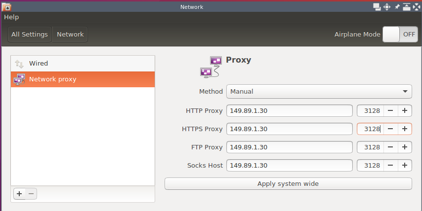

Stuy Proxy Settings
===================

*Written by PChan on 2017-03-11*

You sit in front of the computer and your browser refuses to load anything.  You remember your teacher
telling you about configuring the proxy...

When you login for the first time on your StuyCS account, you need to configure the proxy settings.  Here
are the steps to reach success:

1. On the very left side of the screen, there is a gear icon which leads to **System Settings**.  Click on
   the gear icon.
2. Find and click on **Network**.
3. On the left side of the new window, select **Network Proxy**.
4. On the right side of the window, there are two columns.  In the first column, enter **149.89.1.30**.
   In the second column, enter **3128**.
5. Repeat Step 4 for all four rows.

Here is how it should look like:

When you have verify that it is correct, you may close the network window.
