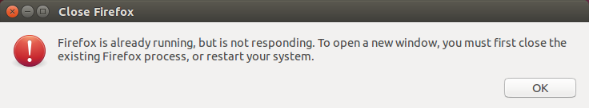

Firefox Already Running Error
=============================

*Written by PChan on 2017-03-11*

Every once in a while, you might get the following error:

The easiest way to resolve the issue of a non-functional browser is to switch to a different one such as
chromium.

For an actual solution:

1. Fire up a terminal
2. Execute the following command:
   ::

      $ find ~/.mozilla/firefox -iname "*lock" -delete

3. Close the terminal and try opening Firefox again
