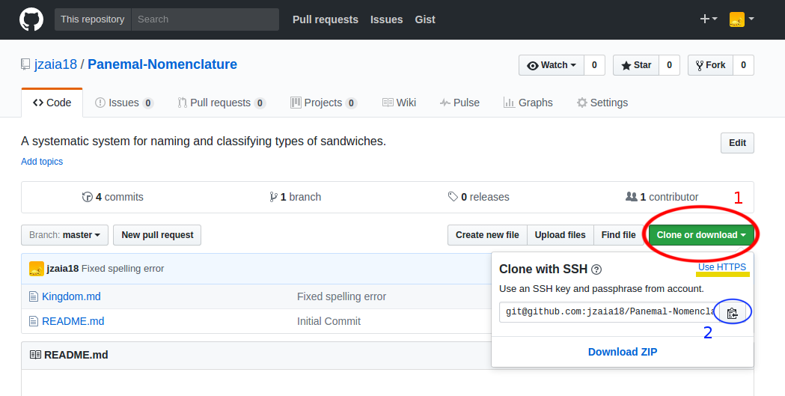

.. _tutorials_programming_tools_git_introduction_to_git:

Introduction to Git
===================

*Written by PChan on 2016-12-08*

* :ref:`tutorials_programming_tools_git_what_is_git`
* :ref:`tutorials_programming_tools_git_general_definitions`
* :ref:`tutorials_programming_tools_git_recommended_workflow`
* :ref:`tutorials_programming_tools_git_basic_operations`

.. _tutorials_programming_tools_git_what_is_git:

What is Git
-----------
Git is a version control system that allows programmers to share their work with others, contribute to
other projects, and allows you to keep track of your progress.  To install Git, check out the
:ref:`installation_programming_tools_git` guide.

.. _tutorials_programming_tools_git_general_definitions:

General Definitions
-------------------
* A **file** may refer to both regular files and directories
* A **repository** is a GitHub project folder containing your project files and metadata regarding the
  version history
* **Upstream** is the online copy of your repository, the state of your repo on GitHub

   In the screenshot, you would first click on the green button circled in red.  To copy the link, simply
   click on the button circled in blue.  In the screenshot, notice that "Use HTTPS" is underlined in
   yellow.  To switch from the SSH link to HTTPS link, simply click on that link.

* **Cloning Link/Repo Link** comes in two forms: SSH links and HTTPS links

  * **HTTPS links**

    * Allows anyone to clone your repository as long as it is public
    * Prompts you for your GitHub credentials when you push
    * Same as the web address of your repository
    * To grab the HTTPS link, either copy the url of the repo page or follow the instructions below:

      1. Click on the green button that says "Clone or download"
      2. Copy the link via Ctrl-C or click on the button to the right of the url

	 .. note::
	    Make sure it says "Clone with HTTPS" in bold; otherwise, click on the "Use HTTPS" link at the top
	    right of the box
    
    * General Structure:
      ::

	 https://github.com/<username>/<repo_name>(.git)
      
  * **SSH links**

    * Only usable if you set up your SSH Keys
    * Faster and more secure authentication
    * To grab the SSH link, follow the instructions below:

      1. Click on the green button that says "Clone or download"
      2. Copy the link via Ctrl-C or click on the button to the right of the url
      
	 .. note::
	    Make sure it says "Clone with SSH" in bold; otherwise, click on the "Use SSH" link at the top
	    right of the box
	    
    * General Structure:
      ::

	 git@github.com:<username>/<repo_name>.git

.. _tutorials_programming_tools_git_recommended_workflow:

Git WorkFlow ProTips
--------------------
When working with partners, try not to modify the same files at the same time.  This leads to merge
conflicts.  Aim to work on separate files.

Before making any additional changes:

  * Pull all changes to avoid merge conflicts
    ::

       $ git pull

.. important::
   Remember to pull before you make additional changes.
       
After making your changes:

  * Make sure to commit and push your changes upstream or your teacher will not see it!
    ::

       $ git add <filename>
       $ git commit -am "<your commit message>"
       $ git push

.. _tutorials_programming_tools_git_basic_operations:

Git Basic Operations
--------------------
**Cloning a repo:** Make a local copy of the repository.
::

   $ git clone <repo_link>

.. note::
   Repo links are defined above

**Pulling from upstream:** Sync your local copy with upstream by downloading and merging any changes.
Always do this before you make any changes to your repo, or else merge conflicts will hound you to death.
::

   $ git pull

.. important::
   Again, remember to **PULL** before you make additional changes.
   
**Find the status of your repo:** Check if you have added new files, modified any files, or need to
commit.
::

   $ git status

**Add changes:** Tell Git to track the files you specify.  This is crucial for getting the changes onto
GitHub.  There are two forms of this command:
::

   // Tell Git to keep an eye on all files in current directory
   $ git add .
   // Tell Git to keep an eye on all previously added files, and this additional file
   $ git add <filename>

.. note::
   The ``-A`` flag can be used to tell Git to track removed files.

**Committing changes:** This command prepares the files you added for upload.  This does **NOT** modify
your repo.  Use this command to "save" your work, create a unique hash, and keep a record of the changes
made and the authors who made them.  Typically a message is passed specifying what changes were made.
::

   // Surround your messages with quotes
   $ git commit -am "<your_commit_message>"

.. note::
   The ``-a`` flag tells Git to add any changes for files it is already tracking before committing

**Pushing to upstream:** Upload any local changes to upstream and merge them.  Remember to do this after
you finished your work locally.
::

   $ git push
   
