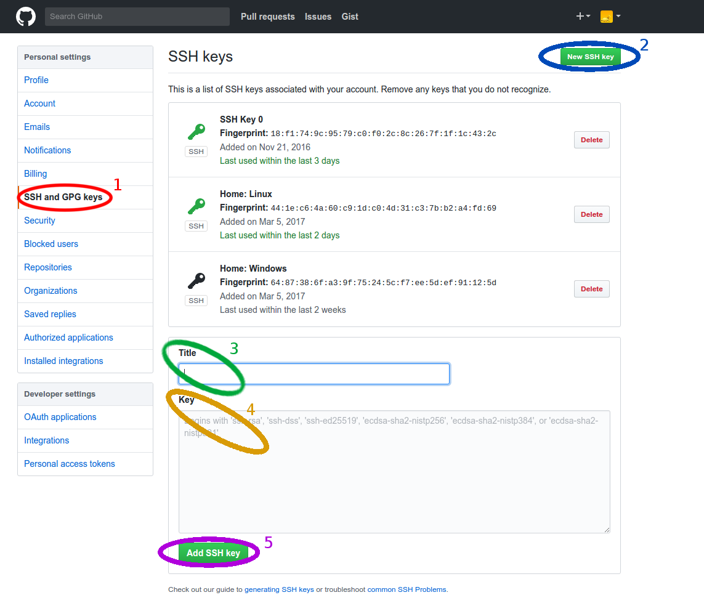

.. |br| raw:: html

    

Guide to SSH Keys
=================

*Written by PChan on 2017-03-17*
   
* :ref:`tutorials_remote_file_transfer_ssh_keys_what_is_ssh_keys`
* :ref:`tutorials_remote_file_transfer_ssh_keys_creating_ssh_keys`
* :ref:`tutorials_remote_file_transfer_ssh_keys_deleting_ssh_keys`
* :ref:`tutorials_remote_file_transfer_ssh_keys_usage`

  * :ref:`tutorials_remote_file_transfer_ssh_keys_github`
  * :ref:`tutorials_remote_file_transfer_ssh_keys_transfer_authentication`

.. _tutorials_remote_file_transfer_ssh_keys_what_is_ssh_keys:

What Are SSH Keys
-----------------
**SSH keys** are access credentials in the SSH protocol with a function similar to that of usernames and
passwords with the following characteristics:

  * More secure and faster mean of authenticating yourself when using a service that supports the SSH
    protocol
  * Composed of a public key and a private key; the public key may be shared with anyone, but the private
    key should be carefully guarded and remain a secret
  * Authenticated when the client is able to successfully decrypt the message encrypted by the public key
    using the private key
    
.. _tutorials_remote_file_transfer_ssh_keys_creating_ssh_keys:

Creating SSH Keys
-----------------
.. note::
   Comments begin after ``//`` and are used to explain the following line.
   |br|
   Default values or keystrokes are nested inside ``[]``.

For Unix users, fire up a terminal to run the next set of instructions.  For Windows users, install Git
Bash if necessary following the :ref:`installation_file_transfer_utilities_ssh_programs_installing_git_bash` guide and then open Git Bash.

Execute the following instructions in the terminal/Git Bash:
::

   $ mkdir -p ~/.ssh
   
   // make sure your email address is inside quotes
   $ ssh-keygen -t rsa -b 4096 -C "<your email address>"

   Enter file in which to save the key (/home/user/.ssh/id_rsa): [Enter]
   Enter passphrase (empty for no passphrase): [Enter]
   Enter same passphrase again: [Enter]

When the program is done generating the key, you should see a SSH key fingerprint like the following:

.. image:: ../../images/software_tutorials/remote_file_transfer/ssh_keys/ssh-keys-fingerprint.png
   
.. _tutorials_remote_file_transfer_ssh_keys_deleting_ssh_keys:

Deleting SSH Keys
-----------------
There are two paths for deleting your SSH Keys.

If you know which pair of keys you want to delete, follow the instructions below:
::

   $ cd ~/.ssh

   // <key name> refer to the filename without the file extension
   $ rm <key name>.pub
   $ rm <key name>

If you are new to the concept of SSH Keys or you have only one set of keys, follow these instructions:
::

   $ rm -rf ~/.ssh
   $ mkdir ~/.ssh

   // read and execute permissions for system so that it can authenticate you
   // when sshing with SSH keys
   $ chmod 705 ~/.ssh

.. _tutorials_remote_file_transfer_ssh_keys_usage:

SSH Keys Usage
--------------
SSH keys are a form of authentication when accessing remote systems via SSH protocol.  Instead of
utilizing a password-based authentication, SSH keys utilize a pair of keys: a private key and a public
key.  The public key is given to the public (ie the machines you want to SSH into) and the private key
should be securely stored on your own machine.

Authentication work by having the remote machine send an encrypted message (using the public key) and
having your machine reply with the decrypted machine (using the private key).  If the decrypted message
matches the original message, you are successfully authenticated.

Unlike password-based authentication, you don't have to memorize a password (although you can choose to
protect the private key with a password) making it more secure.

.. _tutorials_remote_file_transfer_ssh_keys_github:

SSH Keys For GitHub
^^^^^^^^^^^^^^^^^^^
When you clone Git repositories with HTTPS links, you need to enter your credentials each time you push.
It is possible to use SSH keys for authentication instead of your password when pushing which is more
secure and faster.

After generating your SSH keys with the instructions above...

1. Copy the contents of your *public key* via the following commands
::

   // If necessary, replace "~/.ssh/id_rsa.pub" with the path to your public key
   $ cat ~/.ssh/id_rsa.pub

   // Highlight the content of the file with the mouse and press Ctrl-Shift-C (Unix terminal)
   // or Ctrl-Insert (Git Bash) to copy

2. Log in to your Github account
3. On the top right corner, click on your profile picture and select **Settings** in the drop-down list
4. On the left side, select **SSH and GPG keys**
5. Near the top right corner, click on **New SSH key**
6. In the *Title* box, enter a name for the key (use a name that allow you to  differentiate it from your
   other keys)
7. In the *Key* box, paste the content that you copied in step 1
8. Lastly, click on the **Add SSH key**

The image below shows the steps to follow after navigating to the settings on GitHub:

To verify that you have added your SSH keys properly, run the following command in the terminal:
::

   $ ssh -T git@github.com

When prompted to, continue connecting by typing: ``yes``.  If you did it correctly, you should see the
following message:
::

   Hi username! You've successfully authenticated, but GitHub does not
   provide shell access.

Otherwise, double check that you have followed the instructions correctly.
	   
.. _tutorials_remote_file_transfer_ssh_keys_transfer_authentication:

SSH Keys For SSHing or Remote File Transfer
^^^^^^^^^^^^^^^^^^^^^^^^^^^^^^^^^^^^^^^^^^^
Every time you ssh into one of the lab machines, you need to enter your password to authenticate you.  We
can replace this with SSH key authentication.  If you do not have a SSH key pair already, follow the
instructions in the :ref:`tutorials_remote_file_transfer_ssh_keys_creating_ssh_keys` guide.

In a terminal/Git Bash, follow the instructions below:
::

   // username is your StuyCS account username and hostname is clyde.stuycs.org
   $ ssh-copy-id username@hostname

   // Enter your password to your StuyCS account
   // If necessary, enter the passphrase for your SSH Keys at the prompt

   // Test it; you will either be authenticated successfully or need to enter your SSH key passphrase
   $ ssh username@hostname

If the above instructions does not work for you, try:
::

   // The following command create the .ssh folder, set the appropriate permission, and copy the public
   // key over
   $ cat ~/.ssh/id_rsa.pub | ssh username@hostname 'umask 0077'; mkdir -p .ssh; cat >> .ssh/authorized_keys && echo "Key copied"

   // Test it; you will either be authenticated successfully or need to enter your SSH key passphrase
   $ ssh username@hostname
   
