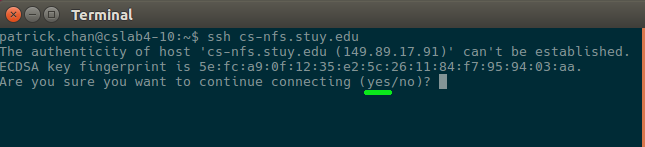
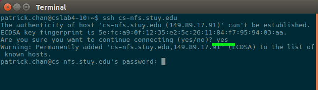
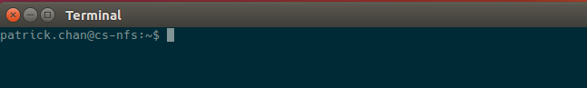
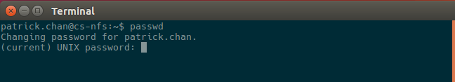

Changing Password
=================

*Written by PChan on 2017-05-25*

* :ref:`change_password_instructions`

.. _change_password_instructions:

Instructions
------------
For security purposes, you should change your password after receiving the login credentials for the
StuyCS accounts.

0. If you are currently in the Dojo, call over a member of the Dojo staff to walk you through the next few steps.

1. Open up a terminal (press ``Ctrl-Alt-t``)

2. Type the following command into the terminal: ``ssh cs-nfs.stuy.edu`` and press ``enter``.

3. If you see the prompt below, type ``yes`` and press enter.

4. When you are prompted for your password, enter in your current password.  You won't see anything when
   you press a key, but don't worry.

5. Upon successful login, you should see the following prompt.

6. To changing-stuycs your password, enter ``passwd`` and press enter.  You will then be prompted for your
   current password.  Like before, you won't be able to see the password as you typed it, but just press
   ``enter`` when you are done.

7. After you enter your current password, you will be prompted for your new password twice.  Like before,
   you won't be able to see the password as you typed it, but just press ``enter`` when you are done.

8. If you are in the Dojo, let the Dojo staff member (that you called over in step 0) know that you just
   resetted your password.  If you are in the presence of your teacher, let him/her know that you changed
   your password.

   There are steps that the teacher(s) need to do before your new password is recognized by the system.

.. important::
   After the teachers have made the necessary changes, **log in** with your new password.  If it works,
   **congratulations!**  Otherwise, let your teacher or the Dojo staff member know that the password change
   attempt was not successful.
